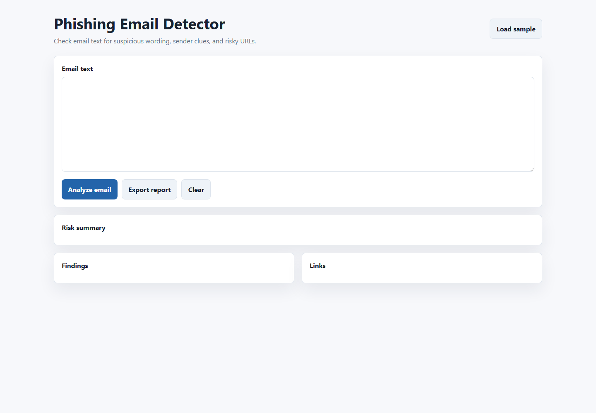

# Phishing Email Detector

A small defensive browser project for practising phishing-awareness checks on fake training emails. It looks for suspicious wording, link mismatches, urgency, and sender clues, then shows the evidence behind the score.

This is intentionally simple. The point is to make the reasoning visible, not to pretend a few rules can replace a real mail-security platform.

## Screenshot



## Run

Open `index.html` in a browser.

## Testing

```bash
npm test
```

The test checks JavaScript syntax, required project files, README sections, screenshot presence, and old template/security placeholder wording.

## What It Does

- Accepts pasted email text.
- Flags common training indicators such as urgency, password-reset wording, and suspicious links.
- Shows matched evidence so the result is reviewable.
- Includes a sample email for local testing.

## Safety Note

Use fake or cleaned examples only. This project is for awareness training and does not collect, submit, or store credentials.

## What I Learned

- The explanation matters more than the score for awareness tools.
- Fake examples need to be realistic enough to teach the pattern without using real private messages.
- Simple rules are a good starting point before adding heavier classification.

## Next Improvements

- Add three built-in examples: safe, suspicious, and obvious training phish.
- Highlight matched phrases directly in the email text.
- Add a small false-positive notes section.

## Portfolio Notes

I keep a short note on the safe browser-based awareness workflow in [docs/portfolio-notes.md](docs/portfolio-notes.md).
